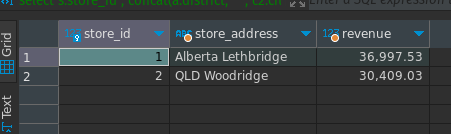
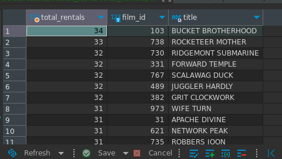
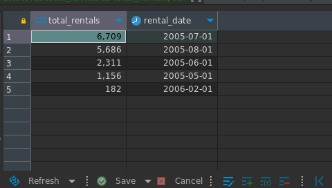
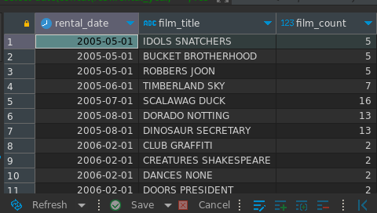
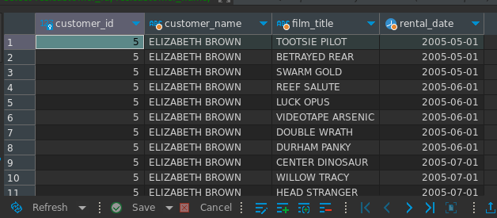
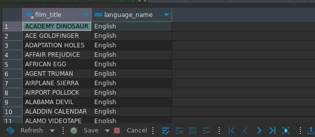
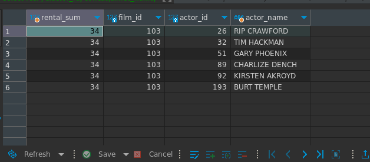

welcome

the following are charts and displays for some sakila queries i have built

queries at `/queries.sql` or `/src/database/queries/index.ts`

since i couldnt find a way to run docker-compose at a cloud service, this project wont be deployed

to run the project + db run `docker compose up -d` and the frondtend will be available at `localhost:3000`

tooling:

- nextjs + chartjs + raw html tags for displaying results
- mysql2 as mysql driver
- sakila/mysql image for sakila seeded db running on a container

query results preview:

`
-- total revenue for each store
`

---

`-- number of times each film has been rented`

---

`-- number of rentals for each year/month`

---

`-- most rented films for each year/month`

---

`-- films rented by customer_id`

---

`-- films list per language`

---

`-- all actors and/or actresses from most rented film`

